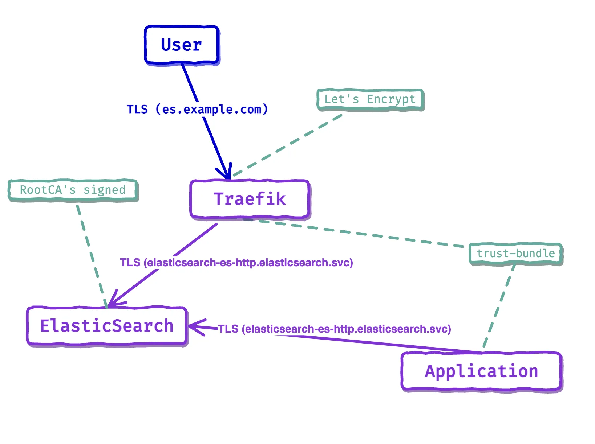

# cert-trust-manager-case

## Cert-manager & trust-manager in Kubernetes cluster

Management of certificates in a Kubernetes cluster using the example of configuring interaction between Traefik and ElasticSearch (ECK) over TLS.

This is repo contains code that I used for my post on Medium:

https://medium.com/@karpulix/cert-manager-trust-manager-in-kubernetes-cluster-9decc8cf6a12 

## Requirements
Server on Ubuntu 24.04
```shell
curl -sfL https://get.k3s.io | sh -
```
Cert & Trust Manager in cluster
```shell
helm repo add jetstack https://charts.jetstack.io --force-update

helm install \
  cert-manager jetstack/cert-manager \
  --namespace cert-manager \
  --create-namespace \
  --version v1.15.3 \
  --set crds.enabled=true

helm upgrade trust-manager jetstack/trust-manager \
  --install \
  --namespace cert-manager \
  --wait
```

Elasticsearch ECK  in cluster
```shell
helm repo add elastic https://helm.elastic.co --force-update
helm install elastic-operator elastic/eck-operator -n elastic-system --create-namespace
helm install elastic-operator-crds elastic/eck-operator-crds
```

## Simplifyed illustration of result


